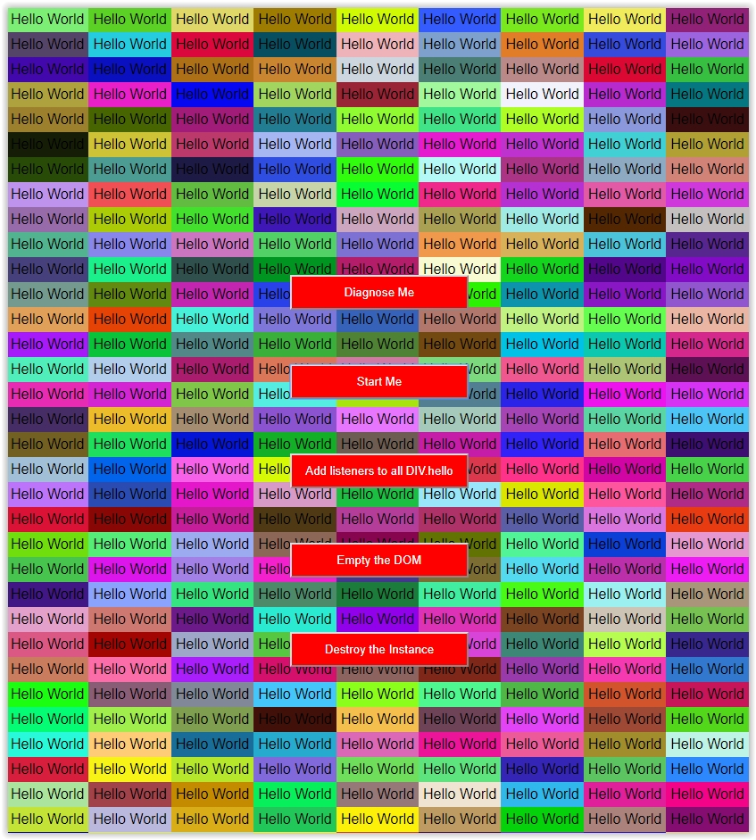

# javascript-memory-performance-tester
a javascript script to test and examine the performance of the browser. 

Here an example to watch, here using Chrome Canary Version 73.0.3643.0 (Build officiel) canary (64 bits)

